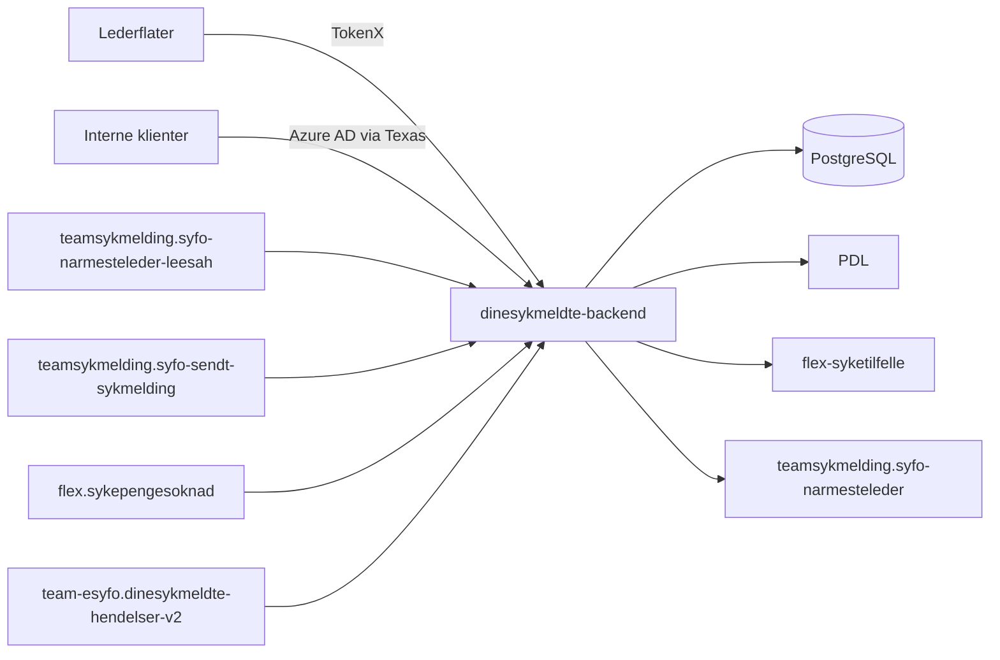

# Backend for nærmeste leders oversikt over sykmeldte (dinesykmeldte)

Dette er backenden for nærmeste leders oversikt over sykmeldte. Tjenesten samler data om sykmeldinger, søknader, hendelser og virksomheter, og gjør dem tilgjengelige for lederflater i team-esyfo.

Repoet brukes av klienter og tjenester som `dinesykmeldte`, `esyfo-narmesteleder`, `oppfolgingsplan-frontend`, `dialogmote-frontend` og `syfo-oppfolgingsplan-backend`, slik de er satt opp i NAIS-manifestene.

## API

OpenAPI-kontrakten ligger i [`api/oas3/dinesykmeldte-backend-api.yaml`](api/oas3/dinesykmeldte-backend-api.yaml). I dev vises kontrakten i Swagger UI på `/api/v1/docs/`. Kontrakten dekker ikke nødvendigvis alle Ktor-ruter i applikasjonen.

Kontrakten dokumenterer blant annet:

- `GET /api/minesykmeldte`
- `GET /api/sykmelding/{sykmeldingId}`
- `PUT /api/sykmelding/{sykmeldingId}/lest`
- `GET /api/soknad/{soknadId}`
- `PUT /api/soknad/{soknadId}/lest`
- `PUT /api/hendelse/{hendelseId}/lest`
- `GET /api/virksomheter`

Koden eksponerer også disse verifiserte endepunktene:

- `GET /api/v2/dinesykmeldte`
- `GET /api/v2/dinesykmeldte/{narmestelederId}`
- `POST /api/narmesteleder/{narmesteLederId}/avkreft`
- `PUT /api/hendelser/read`
- `POST /api/sykmelding/isActiveSykmelding`

## Kafka

Tjenesten konsumerer meldinger fra:

- `teamsykmelding.syfo-narmesteleder-leesah`
- `teamsykmelding.syfo-sendt-sykmelding`
- `flex.sykepengesoknad`
- `team-esyfo.dinesykmeldte-hendelser-v2`

Tjenesten produserer meldinger til:

- `teamsykmelding.syfo-narmesteleder`

Kafka-topicet `dinesykmeldte-hendelser-v2` er definert i [`nais/topics/dinesykmeldte-hendelser-v2.yaml`](nais/topics/dinesykmeldte-hendelser-v2.yaml).

## Autentisering og tilgang

- De fleste API-ene ligger bak TokenX og krever nivå 4.
- `POST /api/sykmelding/isActiveSykmelding` validerer Azure AD-token via Texas.
- NAIS `accessPolicy` åpner for innkommende kall fra verifiserte klienter i manifestene, blant annet `dinesykmeldte`, `esyfo-narmesteleder`, `oppfolgingsplan-frontend`, `dialogmote-frontend` og `syfo-oppfolgingsplan-backend`.

## Utvikling

Bruk `mise tasks` for oppdatert oversikt over tilgjengelige oppgaver.

## Kontakt

Repoet vedlikeholdes av [navikt/team-esyfo](CODEOWNERS).

For Nav-ansatte: kontakt oss i [#esyfo på Slack](https://nav-it.slack.com/archives/C012X796B4L).
